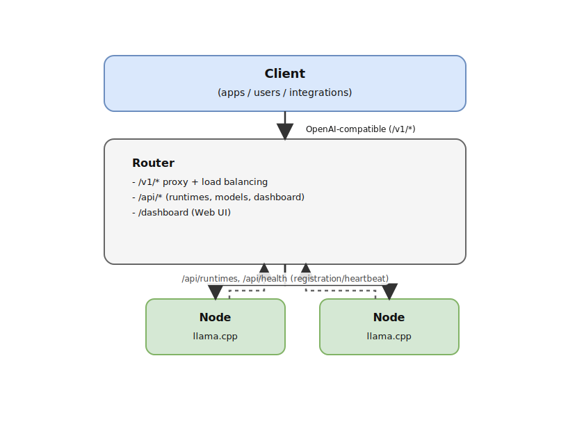

# LLM Load Balancer

[English](./README.md) | 日本語

## 概要

LLM Load Balancer は、複数マシンに配置した推論ランタイムを統合し、単一の OpenAI 互換 API（`/v1/*`）を提供する Rust 製ロードバランサーです。テキスト生成だけでなく、音声認識・音声合成・画像生成などマルチモーダルな AI 機能を統一されたインターフェースで提供します。

### ビジョン

LLM Load Balancer は以下の3つの主要なユースケースに対応します：

1. **プライベート LLM サーバー** - 個人やチームが、データとモデルを完全にコントロールしながら独自の LLM インフラを運用
2. **エンタープライズゲートウェイ** - 企業内での一元管理、アクセス制御、部門横断的な LLM リソースの監視
3. **クラウドプロバイダー統合** - OpenAI、Google、Anthropic の API を同一エンドポイント経由でシームレスにルーティング

### マルチエンジンアーキテクチャ

LLM Load Balancer はマネージャ方式のマルチエンジン構成をサポートします：

| エンジン | ステータス | モデル | ハードウェア |
|---------|-----------|--------|------------|
| **llama.cpp** | 本番稼働 | GGUF形式（LLaMA、Mistral等） | CPU、CUDA、Metal |
| **GPT-OSS** | 本番稼働（Metal/CUDA） | Safetensors（公式GPUアーティファクト） | Apple Silicon、Windows |
| **Whisper** | 本番稼働 | 音声認識（ASR） | CPU、CUDA、Metal |
| **Stable Diffusion** | 本番稼働 | 画像生成 | CUDA、Metal |
| **Nemotron** | 検証中 | Safetensors形式 | CUDA |

**エンジン選択方針**:

- **正本がsafetensorsのモデル**（gpt-oss, Nemotron 3等）:
  - safetensors.cppで動作必須（Metal/CUDA対応必須）
  - GGUF版も動作可能（llama.cpp、サードパーティ変換版）
- **正本がGGUFのモデル**（Llama, Mistral等）:
  - llama.cppで対応（Metal/CUDA対応済み）

### safetensors 対応アーキテクチャ（実装反映）

| アーキテクチャ | 状態 | 備考 |
|--------------|------|------|
| **gpt-oss (MoE + MXFP4)** | 実装済み | `mlp.router.*` と `mlp.experts.*_(blocks\|scales\|bias)` を読み込む |
| **nemotron3 (Mamba-Transformer MoE)** | 準備済み（未統合） | まだforwardパスに接続されていない |

詳細・更新履歴は <https://github.com/akiojin/xLLM>/blob/main/specs/SPEC-69549000/spec.md を参照。

### GGUF アーキテクチャ例（llama.cpp）

GGUF/llama.cpp 経由で対応するアーキテクチャの例です。網羅的ではなく、上流の llama.cpp 互換性に準拠します。

| アーキテクチャ | 対応モデル例 | 備考 |
|--------------|-------------|------|
| **llama** | Llama 3.1, Llama 3.2, Llama 3.3, DeepSeek-R1-Distill-Llama | Meta Llama 系 |
| **mistral** | Mistral, Mistral-Nemo | Mistral AI 系 |
| **gemma** | Gemma3, Gemma3n, Gemma3-QAT, FunctionGemma, EmbeddingGemma | Google Gemma 系 |
| **qwen** | Qwen2.5, Qwen3, QwQ, Qwen3-VL, Qwen3-Coder, Qwen3-Embedding, Qwen3-Reranker | Alibaba Qwen 系 |
| **phi** | Phi-4 | Microsoft Phi 系 |
| **nemotron** | Nemotron | NVIDIA Nemotron 系 |
| **deepseek** | DeepSeek-V3.2, DeepCoder-Preview | DeepSeek 系 |
| **gpt-oss** | GPT-OSS, GPT-OSS-Safeguard | OpenAI GPT-OSS 系 |
| **granite** | Granite-4.0-H-Small/Tiny/Micro, Granite-Docling | IBM Granite 系 |
| **smollm** | SmolLM2, SmolLM3, SmolVLM | HuggingFace SmolLM 系 |
| **kimi** | Kimi-K2 | Moonshot Kimi 系 |
| **moondream** | Moondream2 | Moondream 系 |
| **devstral** | Devstral-Small | Mistral 派生（コーディング特化） |
| **magistral** | Magistral-Small-3.2 | Mistral 派生（マルチモーダル） |

### マルチモーダル対応

テキスト生成に加え、OpenAI 互換 API で以下の機能を提供：

- **音声合成（TTS）**: `/v1/audio/speech` - テキストから自然な音声を生成
- **音声認識（ASR）**: `/v1/audio/transcriptions` - 音声をテキストに変換
- **画像生成**: `/v1/images/generations` - テキストプロンプトから画像を生成

テキスト生成は **Responses API**（`/v1/responses`）を推奨します。Chat Completions は互換用途で残します。

## 主な特徴

- OpenAI 互換 API: `/v1/responses`（推奨）, `/v1/chat/completions`, `/v1/completions`, `/v1/embeddings`, `/v1/models`
- ロードバランシング: 利用可能なエンドポイントへレイテンシベースで自動ルーティング
- ダッシュボード: `/dashboard` でエンドポイント、リクエスト履歴、ログ、モデルを管理
- エンドポイント管理: Ollama、vLLM、xLLM等の外部推論サーバーをロードバランサーから一元管理
- モデル同期: 登録エンドポイントから `GET /v1/models` でモデル一覧を自動同期
- クラウドプレフィックス: `openai:`, `google:`, `anthropic:` を `model` に付けて同一エンドポイントでプロキシ
- 自動アップデート: GitHub Releases検知→承認後にドレイン→再起動。スケジューリング（即時/アイドル/時刻指定）、自動＋手動ロールバック、DL進捗表示に対応

## ダッシュボード

ロードバランサーが `/dashboard` で提供します。

```text
http://localhost:32768/dashboard
```

### Playground ルート

- Endpoint Playground: `/dashboard/#playground/:endpointId`
  - `POST /api/endpoints/:id/chat/completions` を使って特定エンドポイントへ直接送信（JWT）
- LB Playground: `/dashboard/#lb-playground`
  - `GET /v1/models`, `POST /v1/chat/completions` を使ってロードバランサー経由で検証（APIキー）

## エンドポイント管理

ロードバランサーは外部の推論サーバー（Ollama、vLLM、xLLM等）を「エンドポイント」として一元管理します。

### 対応エンドポイント

| タイプ | 説明 | ヘルスチェック |
|-------|------|---------------|
| **xLLM** | 自社推論サーバー（llama.cpp/whisper.cpp等） | `GET /v1/models` |
| **Ollama** | Ollamaサーバー | `GET /v1/models` |
| **vLLM** | vLLM推論サーバー | `GET /v1/models` |
| **OpenAI互換** | その他のOpenAI互換API | `GET /v1/models` |

### エンドポイントタイプ自動判別

エンドポイント登録時に、サーバータイプが自動的に判別されます。

**判別優先度:**

1. **xLLM**: `GET /api/system` で `xllm_version` フィールドを検出
2. **Ollama**: `GET /api/tags` が成功
3. **vLLM**: Server ヘッダーに "vllm" が含まれる
4. **OpenAI互換**: `GET /v1/models` が成功
5. **Unknown**: 判別不能（エンドポイントがオフラインの場合）

**タイプ別機能:**

| 機能 | xLLM | Ollama | vLLM | OpenAI互換 |
|------|------|--------|------|-----------|
| モデルダウンロード | ✓ | - | - | - |
| モデルメタデータ取得 | ✓ | ✓ | - | - |
| max_tokens自動取得 | ✓ | ✓ | - | - |

### xLLM連携（モデルダウンロード）

xLLMタイプのエンドポイントでは、ロードバランサーからモデルのダウンロードを指示できます。

```bash
# ダウンロード開始
curl -X POST http://localhost:32768/api/endpoints/{id}/download \
  -H "Authorization: Bearer sk_your_api_key" \
  -H "Content-Type: application/json" \
  -d '{"model": "llama-3.2-1b"}'

# 進捗確認
curl "http://localhost:32768/api/endpoints/{id}/download/progress?model=llama-3.2-1b" \
  -H "Authorization: Bearer sk_your_api_key"
```

ダッシュボードからも「Download Model」ボタンでダウンロードを開始できます。

### モデルメタデータ取得

xLLMおよびOllamaエンドポイントでは、モデルのコンテキスト長などのメタデータを取得できます。

```bash
curl http://localhost:32768/api/endpoints/{id}/models/{model_id}/info \
  -H "Authorization: Bearer sk_your_api_key"
```

**レスポンス例:**

```json
{
  "model": "llama-3.2-1b",
  "context_length": 131072,
  "capabilities": ["text"]
}
```

### ダッシュボードからの登録

1. ダッシュボード → サイドメニュー「エンドポイント」
2. 「新規エンドポイント」をクリック
3. 名前とベースURLを入力（例: `http://192.168.1.100:11434`）
4. 「接続テスト」で疎通確認 → 「保存」

### REST APIからの登録

```bash
# エンドポイント登録
curl -X POST http://localhost:32768/api/endpoints \
  -H "Authorization: Bearer sk_your_api_key" \
  -H "Content-Type: application/json" \
  -d '{"name": "OllamaサーバーA", "base_url": "http://192.168.1.100:11434"}'

# エンドポイント一覧
curl http://localhost:32768/api/endpoints \
  -H "X-API-Key: sk_admin_scope_key"

# モデル同期
curl -X POST http://localhost:32768/api/endpoints/{id}/sync \
  -H "X-API-Key: sk_admin_scope_key"
```

### ステータス遷移

- **pending**: 登録直後（ヘルスチェック待ち）
- **online**: ヘルスチェック成功
- **offline**: ヘルスチェック失敗
- **error**: 接続エラー

詳細は [specs/SPEC-e8e9326e/quickstart.md](./specs/SPEC-e8e9326e/quickstart.md) を参照。

## LLM アシスタント向け Assistant CLI

2026年2月17日以降、MCP サーバー npm パッケージ（`@llmlb/mcp-server`）は廃止されました。
現在は `llmlb` 本体の `assistant` サブコマンドを利用します。

### 主なコマンド

```bash
# 旧 execute_curl 相当
llmlb assistant curl --command "curl http://localhost:32768/v1/models"

# OpenAPI (JSON) を表示
llmlb assistant openapi

# APIガイドを表示
llmlb assistant guide --category overview
```

### Claude/Codex 連携ファイル

- Claude Code marketplace: `.claude-plugin/marketplace.json`
- Claude plugin: `.claude-plugin/plugins/llmlb-cli/plugin.json`
- Claude skillミラー: `.claude/skills/llmlb-cli-usage/SKILL.md`
- Codex skill: `.codex/skills/llmlb-cli-usage/SKILL.md`
- Codex `.skill` 出力先: `codex-skills/dist/`

```bash
python3 .codex/skills/.system/skill-creator/scripts/package_skill.py \
  .codex/skills/llmlb-cli-usage \
  codex-skills/dist
```

## インストールと起動

### 前提条件

- Linux/macOS/Windows x64 (GPU推奨、CPU推論も対応)
- Rust toolchain (nightly不要) と cargo
- Docker (任意、コンテナ利用時)
- CUDAドライバ (GPU使用時) - [CUDAセットアップ](#cudaセットアップnvidia-gpu)参照

### ビルド済みバイナリのインストール

[GitHub Releases](https://github.com/akiojin/llmlb/releases) からプラットフォーム別のバイナリをダウンロードできます。

| プラットフォーム | ファイル |
|-----------------|---------|
| Linux x86_64 | `llmlb-linux-x86_64.tar.gz` |
| macOS ARM64 (Apple Silicon) | `llmlb-macos-arm64.tar.gz`, `llmlb-macos-arm64.pkg` |
| macOS x86_64 (Intel) | `llmlb-macos-x86_64.tar.gz`, `llmlb-macos-x86_64.pkg` |
| Windows x86_64 | `llmlb-windows-x86_64.zip`, `llmlb-windows-x86_64.msi` |

#### macOS での注意事項

macOS の `.pkg` インストーラーは署名されていないため、初回実行時にセキュリティ警告が表示されます。

**インストール方法:**

1. Finder で `.pkg` ファイルを右クリック → 「開く」を選択
2. 「開く」ボタンをクリックして続行

**または、ターミナルで quarantine 属性を削除:**

```bash
sudo xattr -d com.apple.quarantine llmlb-macos-*.pkg
```

### CUDAセットアップ（NVIDIA GPU）

NVIDIA GPU を使用する場合に必要なコンポーネント：

| コンポーネント | ビルド環境 | 実行環境 |
|--------------|-----------|---------|
| **CUDAドライバ** | 必須 | 必須 |
| **CUDA Toolkit** | 必須（`nvcc`用） | 不要 |

#### CUDAドライバのインストール

CUDAドライバは通常、NVIDIAグラフィックスドライバに含まれています。

```bash
# ドライバのインストール確認
nvidia-smi
```

`nvidia-smi` でGPU情報が表示されれば、ドライバはインストール済みです。

#### CUDA Toolkitのインストール（ビルド環境のみ）

CUDA対応ランタイムのビルド（`BUILD_WITH_CUDA=ON`）にのみ必要です。

**Windows:**

1. [CUDA Toolkit Downloads](https://developer.nvidia.com/cuda-downloads) からダウンロード
2. Windows → x86_64 → 11 → exe (local) を選択
3. インストーラーを実行（Express インストール推奨）
4. 新しいターミナルで確認: `nvcc --version`

**Linux (Ubuntu/Debian):**

```bash
# NVIDIAパッケージリポジトリを追加
wget https://developer.download.nvidia.com/compute/cuda/repos/ubuntu2204/x86_64/cuda-keyring_1.1-1_all.deb
sudo dpkg -i cuda-keyring_1.1-1_all.deb
sudo apt update

# CUDA Toolkitをインストール
sudo apt install cuda-toolkit-12-4

# PATHに追加（~/.bashrc に追記）
export PATH=/usr/local/cuda/bin:$PATH
export LD_LIBRARY_PATH=/usr/local/cuda/lib64:$LD_LIBRARY_PATH

# 確認
nvcc --version
```

**注意:** ビルド済みバイナリを実行するだけの環境（実行環境）では、CUDAドライバのみで
CUDA Toolkitは不要です。

### 1) Rustソースからビルド（推奨）
```bash
git clone https://github.com/akiojin/llmlb.git
cd llmlb
make quality-checks   # fmt/clippy/test/markdownlint 一式
cargo build -p llmlb --release
```
生成物: `target/release/llmlb`

### 2) Docker で起動
```bash
docker build -t llmlb:latest .
docker run --rm -p 32768:32768 --gpus all \
  -e OPENAI_API_KEY=... \
  llmlb:latest
```
GPUを使わない場合は `--gpus all` を外すか、`CUDA_VISIBLE_DEVICES=""` を設定。

### 3) xLLM（C++ Runtime）

C++ Runtime（xLLM）は別リポジトリに分離しました。

- <https://github.com/akiojin/xLLM>

ビルド/実行/環境変数は上記リポジトリを参照してください。

### 4) 基本設定

#### ロードバランサー（Rust）環境変数

| 環境変数 | デフォルト | 説明 |
|---------|-----------|------|
| `LLMLB_HOST` | `0.0.0.0` | バインドアドレス |
| `LLMLB_PORT` | `32768` | リッスンポート |
| `LLMLB_DATABASE_URL` | `sqlite:~/.llmlb/load balancer.db` | データベースURL |
| `LLMLB_DATA_DIR` | `~/.llmlb` | ログ/リクエスト履歴/自動アップデート（キャッシュ・payload）の基準ディレクトリ |
| `LLMLB_JWT_SECRET` | 自動生成 | JWT署名シークレット |
| `LLMLB_ADMIN_USERNAME` | `admin` | 初期管理者ユーザー名 |
| `LLMLB_ADMIN_PASSWORD` | - | 初期管理者パスワード |
| `LLMLB_LOG_LEVEL` | `info` | ログレベル |
| `LLMLB_LOG_DIR` | `~/.llmlb/logs` | ログ保存先 |
| `LLMLB_LOG_RETENTION_DAYS` | `7` | ログ保持日数 |
| `LLMLB_HEALTH_CHECK_INTERVAL` | `30` | ヘルスチェック間隔（秒） |
| `LLMLB_LOAD_BALANCER_MODE` | `auto` | ロードバランサーモード |
| `LLMLB_QUEUE_MAX` | `100` | キュー待機上限 |
| `LLMLB_QUEUE_TIMEOUT_SECS` | `60` | キュー待機タイムアウト（秒） |
| `LLMLB_REQUEST_HISTORY_RETENTION_DAYS` | `7` | リクエスト履歴の保持日数（旧: `REQUEST_HISTORY_RETENTION_DAYS`） |
| `LLMLB_REQUEST_HISTORY_CLEANUP_INTERVAL_SECS` | `3600` | リクエスト履歴のクリーンアップ間隔（秒、旧: `REQUEST_HISTORY_CLEANUP_INTERVAL_SECS`） |
| `LLMLB_DEFAULT_EMBEDDING_MODEL` | `nomic-embed-text-v1.5` | 既定の埋め込みモデル（旧: `LLM_DEFAULT_EMBEDDING_MODEL`） |
| `LLM_DEFAULT_EMBEDDING_MODEL` | `nomic-embed-text-v1.5` | 既定の埋め込みモデル（非推奨） |
| `REQUEST_HISTORY_RETENTION_DAYS` | `7` | リクエスト履歴の保持日数（非推奨） |
| `REQUEST_HISTORY_CLEANUP_INTERVAL_SECS` | `3600` | リクエスト履歴のクリーンアップ間隔（秒、非推奨） |

#### システムトレイ（Windows/macOS）

Windows 10+ / macOS 12+ ではシステムトレイに常駐します。ヘッドレスで起動したい場合は
`llmlb serve --no-tray` を利用してください。

#### 自動アップデート（通知 + 承認後に再起動）

llmlb はバックグラウンドで GitHub Releases を確認し（ベストエフォート、最大24時間キャッシュ）、
更新があればダッシュボードと（Windows/macOS）システムトレイに通知します。

更新を承認（`Restart to update`）すると、以下の順で適用します。

- 新規推論リクエスト（`/v1/*`）を 503 + `Retry-After` で拒否
- in-flight の推論リクエスト（ストリーミング含む）が完了するまで待機（ドレイン、最大300秒）
- 更新を適用して再起動

**アップデートスケジュール:**

- **即時（Immediate）**: 承認後すぐに適用（デフォルト）
- **アイドル時（On idle）**: 推論リクエストがゼロになったタイミングで自動適用
- **時刻指定（Scheduled）**: 日時を指定し、その時刻にドレインを開始して適用

ダッシュボードの設定モーダルまたはスケジューリングAPI
（`POST/GET/DELETE /api/system/update/schedule`）で設定できます。

**ロールバック:**

- **自動**: 更新適用後、新プロセスを30秒間監視し、ヘルスチェック無応答で `.bak` から自動復元
- **手動**: ダッシュボードの「Rollback」ボタンまたは `POST /api/system/update/rollback`
  で `.bak` バックアップから復元（バックアップ存在時のみ）

**ダウンロード進捗:** ダッシュボードにリアルタイムのプログレスバー（バイト数＋パーセント）を表示します。

自動適用方式は OS/インストール形態により分岐します。

- ポータブル配置: 実行ファイルを置換（配置先が書き込み可能な場合）
- macOS `.pkg` / Windows `.msi`: インストーラ実行（必要に応じて権限プロンプト/UAC）
- Linux の書き込み不可配置: 自動適用は非対応（GitHub Releases から手動更新）

詳細は [specs/SPEC-a6e55b37/spec.md](./specs/SPEC-a6e55b37/spec.md) を参照。

クラウドAPI:

- `OPENAI_API_KEY`, `GOOGLE_API_KEY`, `ANTHROPIC_API_KEY`

#### ランタイム（C++）

Runtime（xLLM）の環境変数・設定は xLLM リポジトリに移動しました。

- <https://github.com/akiojin/xLLM>

## 利用方法（OpenAI互換エンドポイント）

### 基本
- `POST /v1/responses`（推奨）
- `POST /v1/chat/completions`（互換）
- `POST /v1/completions`
- `POST /v1/embeddings`

### 画像生成例
```bash
curl http://localhost:32768/v1/images/generations \
  -H "Content-Type: application/json" \
  -H "Authorization: Bearer sk_api_key" \
  -d '{
    "model": "stable-diffusion/v1-5-pruned-emaonly.safetensors",
    "prompt": "A white cat sitting on a windowsill",
    "size": "512x512",
    "n": 1,
    "response_format": "b64_json"
  }'
```

### クラウドモデルプレフィックス
- 付けるだけでクラウド経路に切替: `openai:`, `google:`, `anthropic:`（`ahtnorpic:` も許容）
- 例: `model: "openai:gpt-4o"` / `model: "google:gemini-1.5-pro"` / `model: "anthropic:claude-3-opus"`
- 転送時にプレフィックスは除去され、クラウドAPIへそのまま送られます。
- プレフィックスなしのモデルは従来どおりローカルLLMにルーティングされます。

### ストリーミング
- `stream: true` でクラウドSSE/チャンクをそのままパススルー。

### メトリクス
- `GET /api/metrics/cloud` （Prometheus text）
  - `cloud_requests_total{provider,status}`
  - `cloud_request_latency_seconds{provider}`

## アーキテクチャ

LLM Load Balancer は、ローカルの llama.cpp ランタイムを調整し、オプションでモデルのプレフィックスを介してクラウド LLM プロバイダーにプロキシします。

### コンポーネント
- **LLM Load Balancer (Rust)**: OpenAI 互換のトラフィックを受信し、パスを選択してリクエストをプロキシします。ダッシュボード、メトリクス、管理 API を公開します。
- **Local Runtimes (C++ / llama.cpp)**: GGUF モデルを提供します。ロードバランサーに登録し、ハートビートを送信します。
- **Cloud Proxy**: モデル名が `openai:`, `google:`, `anthropic:` で始まる場合、ロードバランサーは対応するクラウド API に転送します。
- **Storage**: ロードバランサーのメタデータ用の SQLite。モデルファイルは各ランタイムに存在します。
- **Observability**: Prometheus メトリクス、構造化ログ、ダッシュボード統計。

### システム構成



Draw.ioソース: `docs/diagrams/architecture.drawio`（Page: システム構成 (README.ja.md)）

### リクエストフロー
```
Client
  │ POST /v1/chat/completions
  ▼
LLM Load Balancer (OpenAI-compatible)
  ├─ Prefix? → Cloud API (OpenAI / Google / Anthropic)
  └─ No prefix → Scheduler → Local Runtime
                       └─ llama.cpp inference → Response
```

### モデル同期（push配布なし）

- llmlbからランタイムへの push 配布は行いません。
- ランタイムはモデルをオンデマンドで次の順に解決します。
  - ローカルキャッシュ（`LLM_RUNTIME_MODELS_DIR`）
  - 許可リスト内の外部ダウンロード（Hugging Face など、`LLM_RUNTIME_ORIGIN_ALLOWLIST`）
  - ロードバランサーのマニフェスト参照（`GET /api/models/registry/:model_name/manifest.json`）

### スケジューリングとヘルスチェック
- エンドポイントは `/api/endpoints` を介して登録します（ダッシュボードまたはAPI）。CPU のみのエンドポイントも対応しています。
- ヘルスチェックは push ではなく pull 型です。llmlb が定期的にエンドポイントをプローブし、状態/レイテンシを更新してロードバランシングに利用します。
- ダッシュボードには `*_key_present` フラグが表示され、オペレーターはどのクラウドキーが設定されているかを確認できます。

## トラブルシューティング

### 起動時に GPU が見つからない
- 確認: `nvidia-smi` または `CUDA_VISIBLE_DEVICES`
- 環境変数で無効化: ランタイム側 `LLM_ALLOW_NO_GPU=true`（デフォルトは禁止）
- それでも失敗する場合は NVML ライブラリの有無を確認

### クラウドモデルが 401/400 を返す
- ロードバランサー側で `OPENAI_API_KEY` / `GOOGLE_API_KEY` / `ANTHROPIC_API_KEY` が設定されているか確認
- ダッシュボード `/api/dashboard/stats` の `*_key_present` が false なら未設定
- プレフィックスなしモデルはローカルにルーティングされるので、クラウドキーなしで利用したい場合はプレフィックスを付けない

### ポート競合で起動しない
- llmlb: `LLMLB_PORT` を変更（例: `LLMLB_PORT=18080`）
- ランタイム: `LLM_RUNTIME_PORT` または `--port` で変更

### SQLite ファイル作成に失敗
- `LLMLB_DATABASE_URL` のパス先ディレクトリの書き込み権限を確認
- Windows の場合はパスにスペースが含まれていないか確認

### ダッシュボードが表示されない
- ブラウザキャッシュをクリア
- バンドル済み静的ファイルが壊れていないか `cargo clean` → `cargo run` を試す
- リバースプロキシ経由の場合は `/dashboard/*` の静的配信設定を確認

### OpenAI互換APIで 503 / モデル未登録
- オンラインのエンドポイントが存在しない場合 503 を返すことがあります。エンドポイントの起動/モデルロードを待つか、`/api/dashboard/endpoints` または `/api/endpoints` で状態を確認
- モデル指定がローカルに存在しない場合、ランタイムが自動プルするまで待機

### ログが多すぎる / 少なすぎる
- 環境変数 `LLMLB_LOG_LEVEL` または `RUST_LOG` で制御（例: `LLMLB_LOG_LEVEL=info` または `RUST_LOG=llmlb=debug`）
- ランタイムのログは `spdlog` で出力。構造化ログは `tracing_subscriber` でJSON設定可

## モデル管理（Hugging Face, safetensors / GGUF）

- オプション環境変数: レートリミット回避に `HF_TOKEN`、社内ミラー利用時は `HF_BASE_URL` を指定します。
- Web（推奨）:
  - ダッシュボード → **Models** → **Register**
  - `format` を選択します: `safetensors`（ネイティブエンジン） または `gguf`（llama.cpp フォールバック）
    - 同一repoに safetensors と GGUF が両方ある場合、`format` は必須です。
    - safetensors のテキスト生成はネイティブエンジンがある場合のみ対応します
      （safetensors.cppはMetal/CUDA対応）。GGUFのみのモデルは `gguf` を選択してください。
  - Hugging Face repo（例: `nvidia/NVIDIA-Nemotron-3-Nano-30B-A3B-BF16`）またはファイルURLを入力します。
  - `format=gguf` の場合:
    - 目的の `.gguf` を `filename` で直接指定するか、`gguf_policy`（`quality` / `memory` / `speed`）で siblings から自動選択します。
  - `format=safetensors` の場合:
    - HFスナップショットに `config.json` と `tokenizer.json` が必要です。
    - シャーディングされている場合は `.index.json` が必要です。
    - gpt-oss は公式GPUアーティファクトを優先します:
      `model.metal.bin` などが提供されている場合は、対応バックエンドで実行キャッシュとして利用します。
    - Windows は CUDA ビルド（`BUILD_WITH_CUDA=ON`）が必須です。DirectML は非対応です。
  - ロードバランサーは **メタデータ + マニフェストのみ** を保持します（バイナリは保持しません）。
  - モデルIDは Hugging Face の repo ID（例: `org/model`）です。
  - `/v1/models` は、ダウンロード中/待機中/失敗も含め `lifecycle_status` と `download_progress` を返します。
  - ランタイムはモデルをプッシュ配布されず、オンデマンドで取得します:
  - `GET /api/models/registry/:model_name/manifest.json`
- API:
  - `POST /api/models/register` (`repo` と任意の `filename`)
- `/v1/models` は登録済みモデルを返し、`ready` はランタイム同期に基づきます。

## API 仕様

### 認証・権限

#### ユーザー（JWT）

| ロール | 権限 |
|-------|------|
| `admin` | `/api` 管理系 API とダッシュボード機能にフルアクセス |
| `viewer` | ダッシュボード閲覧とエンドポイントREADのみ（管理操作は 403） |

#### APIキー（permissions）

| 権限 | 目的 |
|---|---|
| `openai.inference` | OpenAI互換推論API（`POST /v1/*`、ただし`/v1/models*`を除く） |
| `openai.models.read` | OpenAI互換モデル一覧（`GET /v1/models*`） |
| `endpoints.read` | エンドポイントREAD（`GET /api/endpoints*`） |
| `endpoints.manage` | エンドポイントWRITE（`POST/PUT/DELETE /api/endpoints*`, `POST /api/endpoints/:id/test`, `POST /api/endpoints/:id/sync`, `POST /api/endpoints/:id/download`） |
| `users.manage` | ユーザー管理（`/api/users*`） |
| `invitations.manage` | 招待管理（`/api/invitations*`） |
| `models.manage` | モデル登録/削除（`POST /api/models/register`, `DELETE /api/models/*`） |
| `registry.read` | モデルレジストリ/一覧（`GET /api/models/registry/*`, `GET /api/models`, `GET /api/models/hub`） |
| `logs.read` | エンドポイントログ（`GET /api/endpoints/:id/logs`） |
| `metrics.read` | メトリクス（`GET /api/metrics/cloud`） |

APIキー管理はJWTで本人用エンドポイントを利用します:
- `GET /api/me/api-keys`
- `POST /api/me/api-keys`
- `PUT /api/me/api-keys/:id`
- `DELETE /api/me/api-keys/:id`

`POST /api/me/api-keys` で作成されるキーの権限は固定です:
- `openai.inference`
- `openai.models.read`

**補足**:
- `/api/auth/login` は無認証で、JWTをHttpOnly Cookieに設定します（Authorizationヘッダーも利用可）。
- Cookie認証で変更系操作を行う場合は、`llmlb_csrf` Cookieの値を `X-CSRF-Token` ヘッダーで送信します。
- Cookie認証の変更系操作では Origin/Referer が同一オリジンである必要があります。
- `/api/dashboard/*` は JWTのみ（APIキー不可）。
- `/v1/*` は APIキー必須（permissionsに応じて 403/401）。
- デバッグビルドでは `sk_debug*` 系 API キーが利用可能（`docs/authentication.md` 参照）。

### ロードバランサー（Load Balancer）

#### OpenAI 互換（API キー認証）

- POST `/v1/chat/completions`
- POST `/v1/completions`
- POST `/v1/embeddings`
- POST `/v1/responses`（推奨）
- POST `/v1/audio/transcriptions`
- POST `/v1/audio/speech`
- POST `/v1/images/generations`
- POST `/v1/images/edits`
- POST `/v1/images/variations`
- GET `/v1/models`（API キー）
- GET `/v1/models/:model_id`（API キー）

#### エンドポイント管理

- POST `/api/endpoints`（登録、JWT: admin / APIキー: `endpoints.manage`）
- GET `/api/endpoints`（一覧、JWT: admin/viewer / APIキー: `endpoints.read`）
- GET `/api/endpoints?type=xllm`（タイプフィルター、JWT: admin/viewer / APIキー: `endpoints.read`）
- GET `/api/endpoints/:id`（詳細、JWT: admin/viewer / APIキー: `endpoints.read`）
- GET `/api/endpoints/:id/models`（モデル一覧、JWT: admin/viewer / APIキー: `endpoints.read`）
- PUT `/api/endpoints/:id`（更新、JWT: admin / APIキー: `endpoints.manage`）
- DELETE `/api/endpoints/:id`（削除、JWT: admin / APIキー: `endpoints.manage`）
- POST `/api/endpoints/:id/test`（接続テスト、JWT: admin / APIキー: `endpoints.manage`）
- POST `/api/endpoints/:id/sync`（モデル同期、JWT: admin / APIキー: `endpoints.manage`）
- POST `/api/endpoints/:id/download`（モデルダウンロード、xLLMのみ、JWT: admin / APIキー: `endpoints.manage`）
- GET `/api/endpoints/:id/download/progress`（ダウンロード進捗、JWT: admin/viewer / APIキー: `endpoints.read`）
- GET `/api/endpoints/:id/models/:model/info`（モデルメタデータ、xLLM/Ollamaのみ、JWT: admin/viewer / APIキー: `endpoints.read`）

#### モデル管理

- GET `/api/models`（登録済みモデル一覧、JWT: admin / APIキー: `registry.read`）
- GET `/api/models/hub`（対応モデル一覧+ステータス、JWT: admin / APIキー: `registry.read`）
- POST `/api/models/register`（JWT: admin / APIキー: `models.manage`）
- DELETE `/api/models/*model_name`（JWT: admin / APIキー: `models.manage`）
- GET `/api/models/registry/:model_name/manifest.json`（APIキー: `registry.read`）

#### ダッシュボード/監視

- `/api/dashboard/*` は JWT のみ（APIキー不可）
- GET `/api/dashboard/overview`
- GET `/api/dashboard/stats`
- GET `/api/dashboard/endpoints`
- GET `/api/dashboard/models`
- GET `/api/dashboard/metrics/:runtime_id`
- GET `/api/dashboard/request-history`（legacy）
- GET `/api/dashboard/request-responses`
- GET `/api/dashboard/request-responses/:id`
- GET `/api/dashboard/request-responses/export`
- GET `/api/dashboard/stats/tokens`
- GET `/api/dashboard/stats/tokens/daily`
- GET `/api/dashboard/stats/tokens/monthly`
- GET `/api/dashboard/logs/lb`
- GET `/api/metrics/cloud`（JWT: admin / APIキー: `metrics.read`）
- GET `/api/endpoints/:id/logs`（JWT: admin / APIキー: `logs.read`）
- POST `/api/endpoints/:id/chat/completions`（Endpoint Playground 用、JWTのみ）
- GET `/dashboard/*`

注記:
- `POST /api/endpoints/:id/chat/completions` は Endpoint Playground（`#playground/:endpointId`）専用です。
- LB Playground（`#lb-playground`）は OpenAI 互換API（`/v1/models`, `/v1/chat/completions`）を APIキー認証で利用します。

### ランタイム（Runtime）

#### OpenAI 互換

- GET `/v1/models`
- POST `/v1/chat/completions`
- POST `/v1/completions`
- POST `/v1/embeddings`

#### 運用

- GET `/health`
- GET `/startup`
- GET `/metrics`
- GET `/metrics/prom`
- GET `/api/logs?tail=200`
- GET `/log/level`
- POST `/log/level`

## 開発

詳細な開発ガイドライン、テスト手順、貢献フローについては [CLAUDE.md](./CLAUDE.md) を参照。

```bash
# 品質チェック一式
make quality-checks
```

### PoC

- gpt-oss（自動）: `make poc-gptoss`
- gpt-oss (macOS / Metal): `make poc-gptoss-metal`
- gpt-oss (Linux / CUDA, GGUF・実験扱い): `make poc-gptoss-cuda`
  - `tmp/poc-gptoss-cuda/` にログと作業用ディレクトリを作成します

補足:
- gpt-oss-20b は safetensors（index + shards + config/tokenizer）を正本とします。
- GPU必須（macOS=Metal / Windows=CUDA）。Linux/CUDAは実験扱いです。

Dashboard を更新する場合:

```bash
pnpm install
pnpm --filter @llmlb/dashboard build
```

## ライセンス

MIT License

## 貢献

Issue、Pull Request をお待ちしています。

詳細な開発ガイドラインは [CLAUDE.md](./CLAUDE.md) を参照してください。
