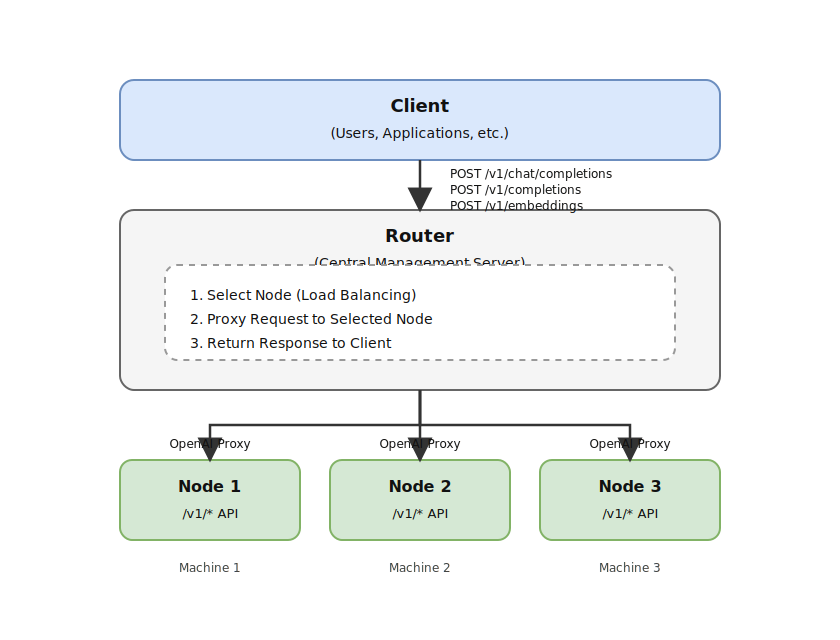

# LLM Load Balancer

A centralized management system for coordinating LLM inference runtimes across multiple machines

English | [日本語](./README.ja.md)

## Overview

LLM Load Balancer is a powerful centralized system that provides unified management and a single API endpoint for multiple LLM inference runtimes running across different machines. It features intelligent load balancing, automatic failure detection, real-time monitoring capabilities, and seamless integration for enhanced scalability.

### Vision

LLM Load Balancer is designed to serve three primary use cases:

1. **Private LLM Server** - For individuals and small teams who want to run their own LLM infrastructure with full control over their data and models
2. **Enterprise Gateway** - For organizations requiring centralized management, access control, and monitoring of LLM resources across departments
3. **Cloud Provider Integration** - Seamlessly route requests to OpenAI, Google, or Anthropic APIs through the same unified endpoint

### Multi-Engine Architecture

LLM Load Balancer uses a manager-based multi-engine architecture:

| Engine | Status | Models | Hardware |
|--------|--------|--------|----------|
| **llama.cpp** | Production | GGUF format (LLaMA, Mistral, etc.) | CPU, CUDA, Metal |
| **GPT-OSS** | Production (Metal/CUDA) | Safetensors (official GPU artifacts) | Apple Silicon, Windows |
| **Whisper** | Production | Speech-to-Text (ASR) | CPU, CUDA, Metal |
| **Stable Diffusion** | Production | Image Generation | CUDA, Metal |
| **Nemotron** | Validation | Safetensors format | CUDA |

Manager-based runtimes replace the legacy plugin system. See `docs/manager-migration.md`
for migration steps.

**Engine Selection Policy**:

- **Models with GGUF available** → Use llama.cpp (Metal/CUDA ready)
- **Models with safetensors only** → Implement built-in engine (Metal/CUDA support required)

### Safetensors Architecture Support (Implementation-Aligned)

| Architecture | Status | Notes |
|-------------|--------|-------|
| **gpt-oss (MoE + MXFP4)** | Implemented | Uses `mlp.router.*` and `mlp.experts.*_(blocks\|scales\|bias)` with MoE forward |
| **nemotron3 (Mamba-Transformer MoE)** | Staged (not wired) | Not connected to the forward pass yet |

See <https://github.com/akiojin/xLLM>/blob/main/specs/SPEC-69549000/spec.md for the authoritative list and updates.

### GGUF Architecture Coverage (llama.cpp, Examples)

These are representative examples of model families supported via GGUF/llama.cpp. This list is
non-exhaustive and follows upstream llama.cpp compatibility.

| Architecture | Example models | Notes |
|-------------|----------------|-------|
| **llama** | Llama 3.1, Llama 3.2, Llama 3.3, DeepSeek-R1-Distill-Llama | Meta Llama family |
| **mistral** | Mistral, Mistral-Nemo | Mistral AI family |
| **gemma** | Gemma3, Gemma3n, Gemma3-QAT, FunctionGemma, EmbeddingGemma | Google Gemma family |
| **qwen** | Qwen2.5, Qwen3, QwQ, Qwen3-VL, Qwen3-Coder, Qwen3-Embedding, Qwen3-Reranker | Alibaba Qwen family |
| **phi** | Phi-4 | Microsoft Phi family |
| **nemotron** | Nemotron | NVIDIA Nemotron family |
| **deepseek** | DeepSeek-V3.2, DeepCoder-Preview | DeepSeek family |
| **gpt-oss** | GPT-OSS, GPT-OSS-Safeguard | OpenAI GPT-OSS family |
| **granite** | Granite-4.0-H-Small/Tiny/Micro, Granite-Docling | IBM Granite family |
| **smollm** | SmolLM2, SmolLM3, SmolVLM | HuggingFace SmolLM family |
| **kimi** | Kimi-K2 | Moonshot Kimi family |
| **moondream** | Moondream2 | Moondream family |
| **devstral** | Devstral-Small | Mistral derivative (coding-focused) |
| **magistral** | Magistral-Small-3.2 | Mistral derivative (multimodal) |

### Multimodal Support

Beyond text generation, LLM Load Balancer provides OpenAI-compatible APIs for:

- **Text-to-Speech (TTS)**: `/v1/audio/speech` - Generate natural speech from text
- **Speech-to-Text (ASR)**: `/v1/audio/transcriptions` - Transcribe audio to text
- **Image Generation**: `/v1/images/generations` - Generate images from text prompts

Text generation should use the **Responses API** (`/v1/responses`) by default. Chat Completions remains
available for compatibility.

## Key Features

- **Unified API Endpoint**: Access multiple LLM runtime instances through a single URL
- **Automatic Load Balancing**: Latency-based request distribution across available endpoints
- **Endpoint Management**: Centralized management of Ollama, vLLM, xLLM and other OpenAI-compatible servers
- **Model Sync**: Automatic model discovery via `GET /v1/models` from registered endpoints
- **Automatic Failure Detection**: Detect offline endpoints and exclude them from routing
- **Real-time Monitoring**: Comprehensive visualization of endpoint states and performance metrics via web dashboard
- **Request History Tracking**: Complete request/response logging with 7-day retention
- **WebUI Management**: Manage endpoints, monitoring, and control through browser-based dashboard
- **Cross-Platform Support**: Works on Windows 10+, macOS 12+, and Linux
- **Self Update (User-Approved)**: Detect new GitHub Releases, notify via dashboard/tray, drain in-flight inference, then restart into the new version — with update scheduling, automatic rollback, and download progress tracking
- **GPU-Aware Routing**: Intelligent request routing based on GPU capabilities and availability
- **Cloud Model Prefixes**: Add `openai:` `google:` or `anthropic:` in the model name to proxy to the corresponding cloud provider while keeping the same OpenAI-compatible endpoint.

## Assistant CLI for LLM Assistants

As of February 17, 2026, the former MCP server package (`@llmlb/mcp-server`) and npm
distribution have been removed. Assistant workflows now use built-in CLI commands.

### Why `llmlb assistant`?

| Feature | `llmlb assistant` | Manual Bash + curl |
|---------|-------------------|--------------------|
| Authentication | Auto-injected from env | Manual header management |
| Security | Host whitelist + injection prevention | No built-in protection |
| Sensitive data | Masked in command echo/output | Exposed in shell history |
| API docs | `assistant openapi` / `assistant guide` | External reference needed |
| Timeout handling | Built-in per request | Manual implementation |

### Core Commands

```bash
# execute_curl equivalent
llmlb assistant curl --command "curl http://localhost:32768/v1/models"

# print OpenAPI JSON
llmlb assistant openapi

# print API guide text
llmlb assistant guide --category overview
```

### Skills / Plugins

- Claude Code plugin metadata: `.claude-plugin/marketplace.json`
- Claude plugin entry: `.claude-plugin/plugins/llmlb-cli/plugin.json`
- Claude skill mirror: `.claude/skills/llmlb-cli-usage/SKILL.md`
- Codex skill: `.codex/skills/llmlb-cli-usage/SKILL.md`
- Codex packaged output directory: `codex-skills/dist/`

```bash
python3 .codex/skills/.system/skill-creator/scripts/package_skill.py \
  .codex/skills/llmlb-cli-usage \
  codex-skills/dist
```

## Quick Start

### LLM Load Balancer (llmlb)

```bash
# Build
cargo build --release -p llmlb

# Run
./target/release/llmlb
# Default: http://0.0.0.0:32768

# Access dashboard
# Open http://localhost:32768/dashboard in browser
# (No internal API token required)
```

**Environment Variables:**

| Variable | Default | Description |
|----------|---------|-------------|
| `LLMLB_HOST` | `0.0.0.0` | Bind address |
| `LLMLB_PORT` | `32768` | Listen port |
| `LLMLB_DATABASE_URL` | `sqlite:~/.llmlb/load balancer.db` | Database URL |
| `LLMLB_LOG_LEVEL` | `info` | Log level |
| `LLMLB_JWT_SECRET` | (auto-generated) | JWT signing secret |
| `LLMLB_ADMIN_USERNAME` | `admin` | Initial admin username |
| `LLMLB_ADMIN_PASSWORD` | (required) | Initial admin password |

**Backward compatibility:** Legacy env var names are supported but deprecated (see full list below).

**System Tray (Windows/macOS only):**

On Windows 10+ and macOS 12+, the load balancer displays a system tray icon.
Double-click to open the dashboard. Docker/Linux runs as a headless CLI process.
Use `llmlb serve --no-tray` to force headless mode on supported platforms.

**Self Update (notification + restart):**

llmlb checks GitHub Releases in the background (best-effort, cached up to 24h). When an update is
available, it notifies via the dashboard and (Windows/macOS) the tray menu.

When you approve the update ("Restart to update"), llmlb rejects new inference requests (`/v1/*`)
with 503 + `Retry-After`, waits for in-flight inference requests (including streaming) to finish,
then applies the update and restarts. A drain timeout of 300 seconds prevents indefinite waiting.

**Update scheduling:**

- **Immediate**: Apply now (default) — drains in-flight requests, then restarts
- **On idle**: Waits until no inference requests are in-flight, then applies automatically
- **Scheduled**: Specify a date/time; llmlb starts the drain at the scheduled time

Configure via dashboard settings modal or the scheduling API
(`POST/GET/DELETE /api/system/update/schedule`).

**Rollback:**

- **Automatic**: After applying an update, llmlb monitors the new process for 30 seconds;
  if the health check fails, it automatically restores from the `.bak` backup
- **Manual**: Use the dashboard "Rollback" button or `POST /api/system/update/rollback`
  when a `.bak` backup exists

**Download progress:** The dashboard shows a real-time progress bar with bytes downloaded
and percentage during update asset downloads.

Auto-apply method depends on the platform/install:

- Portable install: replace the executable in-place when writable
- macOS `.pkg` / Windows `.msi`: run the installer (may require elevation)
- Linux non-writable installs: auto-apply is not supported; reinstall manually from GitHub Releases

For full details, see [specs/SPEC-a6e55b37/spec.md](./specs/SPEC-a6e55b37/spec.md).

### CLI Reference

The CLI provides a small set of management subcommands:

```bash
# Start server (tray on Windows/macOS, headless on Linux)
llmlb serve

# Force headless mode on supported platforms
llmlb serve --no-tray

# Show running server status (lockfile-based)
llmlb status
llmlb status --port 32768

# Stop a running server
llmlb stop --port 32768
```

Day-to-day management is still done via the Dashboard UI (`/dashboard`) or the HTTP APIs.

### xLLM (C++)

The xLLM runtime has moved to a separate repository:

- <https://github.com/akiojin/xLLM>

Build/run instructions and environment variables are documented there.


## Load Balancing

LLM Load Balancer supports multiple load balancing strategies to optimize request distribution across runtimes.

### Strategies

#### 1. Metrics-Based Load Balancing (Recommended)

Selects runtimes based on real-time metrics (CPU usage, memory usage, active requests). This intelligent mode provides optimal performance by dynamically routing requests to the least loaded runtime, ensuring efficient resource utilization.

**Configuration:**
```bash
# Enable metrics-based load balancing
LLMLB_LOAD_BALANCER_MODE=metrics cargo run -p llmlb
```

**Load Score Calculation:**
```
score = cpu_usage + memory_usage + (active_requests × 10)
```

The runtime with the **lowest score** is selected. If all runtimes have CPU usage > 80%, the system automatically falls back to round-robin.

**Example:**
- Runtime A: CPU 20%, Memory 30%, Active 1 → Score = 60 ✓ Selected
- Runtime B: CPU 70%, Memory 50%, Active 5 → Score = 170

#### 2. Advanced Load Balancing (Default)

Combines multiple factors including response time, active requests, and CPU usage to provide sophisticated runtime selection with adaptive performance optimization.

**Configuration:**
```bash
# Use default advanced load balancing (or omit LOAD_BALANCER_MODE)
LLMLB_LOAD_BALANCER_MODE=auto cargo run -p llmlb
```

### Health / Metrics

llmlb performs **pull-based health checks** against registered endpoints. Endpoints do not push
heartbeats to the load balancer (there is no `POST /api/health`).

- Endpoint status is surfaced in the dashboard and `GET /api/endpoints`.
- Prometheus metrics are exported via `GET /api/metrics/cloud` (JWT admin or API key with
  `metrics.read`).

## Architecture

LLM Load Balancer coordinates local llama.cpp runtimes and optionally proxies to cloud LLM providers via model prefixes.

### Components
- **LLM Load Balancer (Rust)**: Receives OpenAI-compatible traffic, chooses a path, and proxies requests. Exposes dashboard, metrics, and admin APIs.
- **Local Runtimes (C++ / llama.cpp)**: Serve GGUF models; register and send heartbeats to the load balancer.
- **Cloud Proxy**: When a model name starts with `openai:` `google:` or `anthropic:` the load balancer forwards to the corresponding cloud API.
- **Storage**: SQLite for load balancer metadata; model files live on each runtime.
- **Observability**: Prometheus metrics, structured logs, dashboard stats.

### System Overview



Draw.io source: `docs/diagrams/architecture.drawio` (Page: System Overview (README.md))

### Request Flow
```
Client
  │ POST /v1/chat/completions
  ▼
LLM Load Balancer (OpenAI-compatible)
  ├─ Prefix? → Cloud API (OpenAI / Google / Anthropic)
  └─ No prefix → Scheduler → Local Runtime
                       └─ llama.cpp inference → Response
```

### Communication Flow (Proxy Pattern)

LLM Load Balancer uses a **Proxy Pattern** - clients only need to know the load balancer URL.

#### Traditional Method (Without LLM Load Balancer)
```bash
# Direct access to each runtime API (default: runtime_port=32769)
curl http://machine1:32769/v1/responses -d '...'
curl http://machine2:32769/v1/responses -d '...'
curl http://machine3:32769/v1/responses -d '...'
```

#### With LLM Load Balancer (Proxy)
```bash
# Unified access to LLM Load Balancer - automatic routing to the optimal runtime
curl http://lb:32768/v1/responses -d '...'
curl http://lb:32768/v1/responses -d '...'
curl http://lb:32768/v1/responses -d '...'
```

**Detailed Request Flow:**

1. **Client → LLM Load Balancer**
   ```
   POST http://lb:32768/v1/responses
   Content-Type: application/json

   {"model": "llama2", "input": "Hello!"}
   ```

2. **LLM Load Balancer Internal Processing**
   - Select optimal runtime (Load Balancing)
   - Forward request to selected runtime via HTTP client

3. **LLM Load Balancer → Runtime (Internal Communication)**
   ```
   POST http://runtime1:32769/v1/responses
   Content-Type: application/json

   {"model": "llama2", "input": "Hello!"}
   ```

4. **Runtime Local Processing**
   - Runtime loads model on-demand (from local cache or load-balancer-provided source)
   - Runtime runs llama.cpp inference and returns an OpenAI-compatible response

5. **LLM Load Balancer → Client (Return Response)**
   ```json
  {
    "id": "resp_123",
    "object": "response",
    "output": [
      {
        "type": "message",
        "role": "assistant",
        "content": [
          { "type": "output_text", "text": "Hello!" }
        ]
      }
    ]
  }
   ```

> **Note**: LLM Load Balancer supports OpenAI-compatible APIs and **recommends** the
> Responses API (`/v1/responses`). Chat Completions remains available for
> compatibility.

**From Client's Perspective**:
- LLM Load Balancer appears as the only OpenAI-compatible API server
- No need to be aware of multiple internal runtimes
- Complete with a single HTTP request

### Model Sync (No Push Distribution)

- the load balancer never pushes models to runtimes.
- Runtimes resolve models on-demand in this order:
  - local cache (`LLM_RUNTIME_MODELS_DIR`)
  - allowlisted origin download (Hugging Face, etc.; configure via `LLM_RUNTIME_ORIGIN_ALLOWLIST`)
  - manifest-based selection from the load balancer (`GET /api/models/registry/:model_name/manifest.json`)

### Scheduling & Health
- Endpoints are registered via `/api/endpoints` (dashboard UI or API). CPU-only endpoints are also supported.
- Health is pull-based: llmlb periodically probes endpoints and uses status/latency for load balancing.
- Dashboard surfaces `*_key_present` flags so operators see which cloud keys are configured.

### Benefits of Proxy Pattern

1. **Unified Endpoint**
   - Clients only need to know the load balancer URL
   - No need to know each runtime location

2. **Transparent Load Balancing**
  - LLM Load Balancer automatically selects the optimal runtime
   - Clients benefit from load distribution without awareness

3. **Automatic Retry on Failure**
  - If Runtime1 fails → LLM Load Balancer automatically tries Runtime2
   - No re-request needed from client

4. **Security**
   - Runtime IP addresses not exposed to clients
  - Only LLM Load Balancer needs to be publicly accessible

5. **Scalability**
   - Adding runtimes automatically increases processing capacity
   - No changes needed on client side

## Project Structure

```
llmlb/
├── llmlb/              # Rust load balancer (HTTP APIs, dashboard, proxy, common types)
├── xllm (external)     # <https://github.com/akiojin/xLLM>
├── .claude-plugin/      # Claude Code plugin metadata and bundled skills
├── .codex/skills/       # Codex skills (source)
├── codex-skills/dist/   # Packaged Codex .skill artifacts
└── specs/               # Specifications (Spec-Driven Development)
```

## Dashboard

The dashboard is served by the load balancer at `/dashboard`.
Use it to monitor endpoints, view request history, inspect logs, and manage models.

### Quick usage

1. Start the load balancer:
   ```bash
   cargo run -p llmlb
   ```
1. Open:
   ```text
   http://localhost:32768/dashboard
   ```

### Playground routes

- Endpoint Playground: `/dashboard/#playground/:endpointId`
  - For direct endpoint verification via `POST /api/endpoints/:id/chat/completions` (JWT session)
- LB Playground: `/dashboard/#lb-playground`
  - For load-balancer routing tests via `GET /v1/models` and `POST /v1/chat/completions` (API key)

## Endpoint Management

the load balancer centrally manages external inference servers (Ollama, vLLM, xLLM, etc.) as "endpoints".

### Supported Endpoints

| Type | Description | Health Check |
|------|-------------|--------------|
| **xLLM** | In-house inference server (llama.cpp/whisper.cpp) | `GET /v1/models` |
| **Ollama** | Ollama server | `GET /v1/models` |
| **vLLM** | vLLM inference server | `GET /v1/models` |
| **OpenAI-compatible** | Other OpenAI-compatible APIs | `GET /v1/models` |

### Registration via Dashboard

1. Dashboard → Sidebar "Endpoints"
2. Click "New Endpoint"
3. Enter name and base URL (e.g., `http://192.168.1.100:11434`)
4. "Connection Test" → "Save"

### Registration via REST API

```bash
# Register endpoint
curl -X POST http://localhost:32768/api/endpoints \
  -H "Authorization: Bearer sk_your_api_key" \
  -H "Content-Type: application/json" \
  -d '{"name": "Ollama Server A", "base_url": "http://192.168.1.100:11434"}'

# List endpoints
curl http://localhost:32768/api/endpoints \
  -H "Authorization: Bearer sk_your_api_key"

# Sync models
curl -X POST http://localhost:32768/api/endpoints/{id}/sync \
  -H "Authorization: Bearer sk_your_api_key"
```

### Status Transitions

- **pending**: Just registered (awaiting health check)
- **online**: Health check successful
- **offline**: Health check failed
- **error**: Connection error

For details, see [specs/SPEC-e8e9326e/quickstart.md](./specs/SPEC-e8e9326e/quickstart.md).

## Hugging Face registration (safetensors / GGUF)

- Optional env vars: set `HF_TOKEN` to raise Hugging Face rate limits; set `HF_BASE_URL` when using a mirror/cache.
- Web (recommended):
  - Dashboard → **Models** → **Register**
  - Choose `format`: `safetensors` (native engines) or `gguf` (llama.cpp fallback).
    - If the repo contains both `safetensors` and `.gguf`, `format` is required.
    - Safetensors text generation is available only when the safetensors.cpp engine is enabled
      (Metal/CUDA). Use `gguf` for GGUF-only models.
  - Enter a Hugging Face repo or file URL (e.g. `nvidia/NVIDIA-Nemotron-3-Nano-30B-A3B-BF16`).
  - For `format=gguf`:
    - Either specify an exact `.gguf` `filename`, or choose `gguf_policy` (`quality` / `memory` / `speed`)
      to auto-pick from GGUF siblings.
  - For `format=safetensors`:
    - The HF snapshot must include `config.json` and `tokenizer.json`.
    - Sharded weights must include an `.index.json`.
    - If official GPU artifacts are provided (for example `model.metal.bin`), they may be used as
      execution cache when supported. Otherwise, safetensors are used directly.
    - Windows requires CUDA builds (`BUILD_WITH_CUDA=ON`). DirectML is not supported.
  - LLM Load Balancer stores **metadata + manifest only** (no binary download).
  - Model IDs are the Hugging Face repo ID (e.g. `org/model`).
  - `/v1/models` lists models including queued/caching/error with `lifecycle_status` + `download_progress`.
  - Runtimes pull models on-demand via the model registry endpoints:
    - `GET /api/models/registry/:model_name/manifest.json`
    - `GET /api/models/registry/:model_name/files/:file_name`
    - (Legacy) `GET /api/models/blob/:model_name` for single-file GGUF.
- API:
  - `POST /api/models/register` with `repo` and optional `filename`.
- `/v1/models` lists registered models; `ready` reflects runtime sync status.

## Installation

### Prerequisites

- Linux/macOS/Windows x64 (GPU recommended)
- Rust toolchain (stable) and cargo
- Docker (optional)
- CUDA Driver (for NVIDIA GPU) - see [CUDA Setup](#cuda-setup-nvidia-gpu)

### Pre-built Binaries

Download platform-specific binaries from [GitHub Releases](https://github.com/akiojin/llmlb/releases).

| Platform | Files |
|----------|-------|
| Linux x86_64 | `llmlb-linux-x86_64.tar.gz` |
| macOS ARM64 (Apple Silicon) | `llmlb-macos-arm64.tar.gz`, `llmlb-macos-arm64.pkg` |
| macOS x86_64 (Intel) | `llmlb-macos-x86_64.tar.gz`, `llmlb-macos-x86_64.pkg` |
| Windows x86_64 | `llmlb-windows-x86_64.zip`, `llmlb-windows-x86_64.msi` |

#### macOS Notes

The macOS `.pkg` installers are not code-signed, so you'll see a security warning on first run.

**To install:**

1. Right-click the `.pkg` file in Finder → Select "Open"
2. Click "Open" to proceed

**Or remove the quarantine attribute via Terminal:**

```bash
sudo xattr -d com.apple.quarantine llmlb-macos-*.pkg
```

### CUDA Setup (NVIDIA GPU)

For NVIDIA GPU acceleration, you need:

| Component | Build Environment | Runtime Environment |
|-----------|-------------------|---------------------|
| **CUDA Driver** | Required | Required |
| **CUDA Toolkit** | Required (for `nvcc`) | Not required |

#### Installing CUDA Driver

The CUDA Driver is typically installed with NVIDIA graphics drivers.

```bash
# Verify driver installation
nvidia-smi
```

If `nvidia-smi` shows your GPU, the driver is installed.

#### Installing CUDA Toolkit (Build Environment Only)

Required only for building the runtime with CUDA support (`BUILD_WITH_CUDA=ON`).

**Windows:**

1. Download from [CUDA Toolkit Downloads](https://developer.nvidia.com/cuda-downloads)
2. Select: Windows → x86_64 → 11 → exe (local)
3. Run the installer (Express installation recommended)
4. Verify: Open new terminal and run `nvcc --version`

**Linux (Ubuntu/Debian):**

```bash
# Add NVIDIA package repository
wget https://developer.download.nvidia.com/compute/cuda/repos/ubuntu2204/x86_64/cuda-keyring_1.1-1_all.deb
sudo dpkg -i cuda-keyring_1.1-1_all.deb
sudo apt update

# Install CUDA Toolkit
sudo apt install cuda-toolkit-12-4

# Add to PATH (add to ~/.bashrc)
export PATH=/usr/local/cuda/bin:$PATH
export LD_LIBRARY_PATH=/usr/local/cuda/lib64:$LD_LIBRARY_PATH

# Verify
nvcc --version
```

**Note:** Runtime environments (runtimes running pre-built binaries) only need the CUDA
Driver, not the full Toolkit.

### 1) Build from Rust source (Recommended)
```bash
git clone https://github.com/akiojin/llmlb.git
cd llmlb
make quality-checks   # fmt/clippy/test/markdownlint
cargo build -p llmlb --release
```
Artifact: `target/release/llmlb`

### 2) Run with Docker
```bash
docker build -t llmlb:latest .
docker run --rm -p 32768:32768 --gpus all \
  -e OPENAI_API_KEY=... \
  llmlb:latest
```
If not using GPU, remove `--gpus all` or set `CUDA_VISIBLE_DEVICES=""`.

### 3) C++ Runtime Build
See <https://github.com/akiojin/xLLM> for runtime build/run details.

### Requirements

- **LLM Load Balancer**: Rust toolchain (stable)
- **Runtime**: CMake + a C++ toolchain, and a supported GPU (NVIDIA / AMD / Apple Silicon)

## Usage

### Basic Usage

1. **Start LLM Load Balancer**
   ```bash
   ./target/release/llmlb
   # Default: http://0.0.0.0:32768
   ```

2. **Start Runtimes on Multiple Machines**
   ```bash
   # Machine 1
   LLMLB_URL=http://lb:32768 \
   # Replace with your actual API key (scope: runtime)
   LLM_RUNTIME_API_KEY=sk_your_runtime_register_key \

   # Machine 2
   LLMLB_URL=http://lb:32768 \
   # Replace with your actual API key (scope: runtime)
   LLM_RUNTIME_API_KEY=sk_your_runtime_register_key \
   ```

3. **Send Inference Requests to LLM Load Balancer (OpenAI-compatible, Responses API recommended)**
   ```bash
   curl http://lb:32768/v1/responses \
     -H "Content-Type: application/json" \
     -H "Authorization: Bearer sk_your_api_key" \
     -d '{
       "model": "gpt-oss-20b",
       "input": "Hello!"
     }'
   ```

   **Image generation example**
   ```bash
   curl http://lb:32768/v1/images/generations \
     -H "Content-Type: application/json" \
     -H "Authorization: Bearer sk_your_api_key" \
     -d '{
       "model": "stable-diffusion/v1-5-pruned-emaonly.safetensors",
       "prompt": "A white cat sitting on a windowsill",
       "size": "512x512",
       "n": 1,
       "response_format": "b64_json"
     }'
   ```

   **Image understanding example**
   ```bash
   curl http://lb:32768/v1/chat/completions \
     -H "Content-Type: application/json" \
     -H "Authorization: Bearer sk_your_api_key" \
     -d '{
       "model": "llava-v1.5-7b",
       "messages": [
         {
           "role": "user",
           "content": [
             {"type": "text", "text": "What is in this image?"},
             {"type": "image_url", "image_url": {"url": "data:image/png;base64,iVBORw0KGgoAAAANSUhEUgAAAAEAAAABCAYAAAAfFcSJAAAADUlEQVR42mNk+M9QDwADhgGAWjR9awAAAABJRU5ErkJggg=="}}
           ]
         }
       ],
       "max_tokens": 300
     }'
   ```
4. **List Registered Endpoints**
   ```bash
   curl http://lb:32768/api/endpoints \
     # JWT (admin/viewer):
     -H "Authorization: Bearer <jwt>"
     # or API key (permissions: endpoints.read):
     # -H "X-API-Key: sk_your_endpoints_read_key"
   ```

### Environment Variables

#### LLM Load Balancer (llmlb)

| Variable | Default | Description | Legacy / Notes |
|----------|---------|-------------|----------------|
| `LLMLB_HOST` | `0.0.0.0` | Bind address | - |
| `LLMLB_PORT` | `32768` | Listen port | - |
| `LLMLB_DATABASE_URL` | `sqlite:~/.llmlb/load balancer.db` | Database URL | `DATABASE_URL` |
| `LLMLB_DATA_DIR` | `~/.llmlb` | Base directory for logs, request history, and self-update cache/payload | - |
| `LLMLB_JWT_SECRET` | (auto-generated) | JWT signing secret | `JWT_SECRET` |
| `LLMLB_ADMIN_USERNAME` | `admin` | Initial admin username | `ADMIN_USERNAME` |
| `LLMLB_ADMIN_PASSWORD` | (required, first run) | Initial admin password | `ADMIN_PASSWORD` |
| `LLMLB_LOG_LEVEL` | `info` | Log level (`EnvFilter`) | `LLM_LOG_LEVEL`, `RUST_LOG` |
| `LLMLB_LOG_DIR` | `~/.llmlb/logs` | Log directory | `LLM_LOG_DIR` (deprecated) |
| `LLMLB_LOG_RETENTION_DAYS` | `7` | Log retention days | `LLM_LOG_RETENTION_DAYS` |
| `LLMLB_HEALTH_CHECK_INTERVAL` | `30` | Endpoint health check interval (seconds) | `HEALTH_CHECK_INTERVAL` |
| `LLMLB_LOAD_BALANCER_MODE` | `auto` | Load balancer mode (`auto` / `metrics`) | `LOAD_BALANCER_MODE` |
| `LLMLB_QUEUE_MAX` | `100` | Admission queue limit | `QUEUE_MAX` |
| `LLMLB_QUEUE_TIMEOUT_SECS` | `60` | Admission queue timeout (seconds) | `QUEUE_TIMEOUT_SECS` |
| `LLMLB_REQUEST_HISTORY_RETENTION_DAYS` | `7` | Request history retention days | `REQUEST_HISTORY_RETENTION_DAYS` |
| `LLMLB_REQUEST_HISTORY_CLEANUP_INTERVAL_SECS` | `3600` | Request history cleanup interval (seconds) | `REQUEST_HISTORY_CLEANUP_INTERVAL_SECS` |
| `LLMLB_DEFAULT_EMBEDDING_MODEL` | `nomic-embed-text-v1.5` | Default embedding model | `LLM_DEFAULT_EMBEDDING_MODEL` |
| `LLM_DEFAULT_EMBEDDING_MODEL` | `nomic-embed-text-v1.5` | Default embedding model | deprecated (use `LLMLB_DEFAULT_EMBEDDING_MODEL`) |
| `REQUEST_HISTORY_RETENTION_DAYS` | `7` | Request history retention days | deprecated (use `LLMLB_REQUEST_HISTORY_RETENTION_DAYS`) |
| `REQUEST_HISTORY_CLEANUP_INTERVAL_SECS` | `3600` | Request history cleanup interval (seconds) | deprecated (use `LLMLB_REQUEST_HISTORY_CLEANUP_INTERVAL_SECS`) |

Cloud / external services:

| Variable | Default | Description | Notes |
|----------|---------|-------------|-------|
| `OPENAI_API_KEY` | - | API key for `openai:` models | required |
| `OPENAI_BASE_URL` | `https://api.openai.com` | Override OpenAI base URL | optional |
| `GOOGLE_API_KEY` | - | API key for `google:` models | required |
| `GOOGLE_API_BASE_URL` | `https://generativelanguage.googleapis.com/v1beta` | Override Google base URL | optional |
| `ANTHROPIC_API_KEY` | - | API key for `anthropic:` models | required |
| `ANTHROPIC_API_BASE_URL` | `https://api.anthropic.com` | Override Anthropic base URL | optional |
| `HF_TOKEN` | - | Hugging Face token for model pulls | optional |
| `LLMLB_API_KEY` | - | API key used by e2e tests/clients | client/test use |

#### Runtime (llm-runtime)

| Variable | Default | Description | Legacy / Notes |
|----------|---------|-------------|----------------|
| `LLMLB_URL` | `http://127.0.0.1:32768` | Load balancer URL to register with | - |
| `LLM_RUNTIME_API_KEY` | - | API key for runtime registration / model registry download | scope: `runtime` |
| `LLM_RUNTIME_PORT` | `32769` | Runtime listen port | - |
| `LLM_RUNTIME_MODELS_DIR` | `~/.llmlb/models` | Model storage directory | `LLM_MODELS_DIR` |
| `LLM_RUNTIME_ORIGIN_ALLOWLIST` | `huggingface.co/*,cdn-lfs.huggingface.co/*` | Allowlist for direct origin downloads (comma-separated) | `LLM_ORIGIN_ALLOWLIST` |
| `LLM_RUNTIME_BIND_ADDRESS` | `0.0.0.0` | Bind address | `LLM_BIND_ADDRESS` |
| `LLM_RUNTIME_IP` | auto-detected | Runtime IP reported to load balancer | - |
| `LLM_RUNTIME_HEARTBEAT_SECS` | `10` | Heartbeat interval (seconds) | `LLM_HEARTBEAT_SECS` |
| `LLM_RUNTIME_LOG_LEVEL` | `info` | Log level | `LLM_LOG_LEVEL`, `LOG_LEVEL` |
| `LLM_RUNTIME_LOG_DIR` | `~/.llmlb/logs` | Log directory | `LLM_LOG_DIR` |
| `LLM_RUNTIME_LOG_RETENTION_DAYS` | `7` | Log retention days | `LLM_LOG_RETENTION_DAYS` |
| `LLM_RUNTIME_CONFIG` | `~/.llmlb/config.json` | Path to runtime config file | - |
| `LLM_MODEL_IDLE_TIMEOUT` | unset | Seconds before unloading idle models | enabled when set |
| `LLM_MAX_LOADED_MODELS` | unset | Cap on simultaneously loaded models | enabled when set |
| `LLM_MAX_MEMORY_BYTES` | unset | Max memory for loaded models | enabled when set |

**Backward compatibility**: Legacy names are read for fallback but are deprecated—prefer the new names above.

Note: Engine plugins were removed in favor of built-in managers. See <<https://github.com/akiojin/xLLM>/blob/main/docs/migrations/plugin-to-manager.md>.

## Troubleshooting

### GPU not found at startup
- Check: `nvidia-smi` or `CUDA_VISIBLE_DEVICES`
- Disable via env var: Runtime side `LLM_ALLOW_NO_GPU=true` (disabled by default)
- If it still fails, check for NVML library presence

### Cloud models return 401/400
- Check if `OPENAI_API_KEY` / `GOOGLE_API_KEY` / `ANTHROPIC_API_KEY` are set on the load balancer side
- If `*_key_present` is false in Dashboard `/api/dashboard/stats`, it's not set
- Models without prefixes are routed locally, so do not add a prefix if you don't have cloud keys

### Port conflict
- LLM Load Balancer: Change `LLMLB_PORT` (e.g., `LLMLB_PORT=18080`)
- Runtime: Change `LLM_RUNTIME_PORT` or use `--port`

### SQLite file creation failed
- Check write permissions for the directory in `LLMLB_DATABASE_URL` path
- On Windows, check if the path contains spaces

### Dashboard does not appear
- Clear browser cache
- Try `cargo clean` -> `cargo run` to check if bundled static files are broken
- Check static delivery settings for `/dashboard/*` if using a reverse proxy

### OpenAI compatible API returns 503 / Model not registered
- Returns 503 if there are no online endpoints. Wait for endpoint startup/model load or check status at `/api/dashboard/endpoints` (JWT) or `/api/endpoints` (JWT/API key).
- If specified model does not exist locally, wait for runtime to auto-pull

### Too many / too few logs
- Control via `LLMLB_LOG_LEVEL` or `RUST_LOG` env var (e.g., `LLMLB_LOG_LEVEL=info` or `RUST_LOG=llmlb=debug`)
- Runtime logs use `spdlog`. Structured logs can be configured via `tracing_subscriber`

## Development

For detailed development guidelines, testing procedures, and contribution workflow, see
[CLAUDE.md](./CLAUDE.md).

```bash
# Full quality gate
make quality-checks
```

### PoCs

- gpt-oss (auto): `make poc-gptoss`
- gpt-oss (macOS / Metal): `make poc-gptoss-metal`
- gpt-oss (Linux / CUDA via GGUF, experimental): `make poc-gptoss-cuda`
  - Logs/workdir are created under `tmp/poc-gptoss-cuda/` (lb/runtime logs, request JSON, etc.)

Notes:
- gpt-oss-20b uses safetensors (index + shards + config/tokenizer) as the source of truth.
- GPU is required. Supported backends: macOS (Metal) and Windows (CUDA). Linux/CUDA is experimental.

### Spec-Driven Development

This project follows Spec-Driven Development:

1. `/speckit.specify` - Create feature specification
2. `/speckit.plan` - Create implementation plan
3. `/speckit.tasks` - Break down into tasks
4. Execute tasks (strict TDD cycle)

See [CLAUDE.md](./CLAUDE.md) for details.

### Claude Code Worktree Hooks

This project uses Claude Code PreToolUse Hooks to enforce Worktree environment
boundaries and prevent accidental operations that could disrupt the development workflow.

**Features:**

- **Git Branch Protection**: Blocks `git checkout`, `git switch`, `git worktree`
commands to prevent branch switching
- **Directory Navigation Control**: Blocks `cd` commands that would move outside
the Worktree boundary
- **Smart Allow Lists**: Permits read-only operations like `git branch --list`
- **Fast Execution**: Average response time < 50ms (target: < 100ms)

**Installation & Configuration:**

For detailed setup instructions, manual testing examples, and troubleshooting, see:

- [Quickstart Guide](./specs/SPEC-dc648675/quickstart.md) - Step-by-step setup
and verification
- [Feature Specification](./specs/SPEC-dc648675/spec.md) - Requirements and
acceptance criteria
- [Implementation Plan](./specs/SPEC-dc648675/plan.md) - Technical design and
architecture
- [Performance Report](./specs/SPEC-dc648675/performance.md) - Benchmark results

**Running Hook Tests:**

```bash
# Run all Hook contract tests (13 test cases)
make test-hooks

# Or run manually with Bats
npx bats tests/hooks/test-block-git-branch-ops.bats tests/hooks/test-block-cd-command.bats

# Run performance benchmark
tests/hooks/benchmark-hooks.sh
```

**Automated Testing:**

Hook tests are automatically executed in CI/CD:

- GitHub Actions: `.github/workflows/test-hooks.yml` (standalone)
- Quality Checks: `.github/workflows/quality-checks.yml` (integrated)
- Makefile: `make quality-checks` includes `test-hooks` target

## Request History

LLM Load Balancer automatically logs all requests and responses for debugging,
auditing, and analysis purposes.

### Features

- **Complete Request/Response Logging**: Captures full request bodies,
response bodies, and metadata
- **Automatic Retention**: Keeps history for 7 days with automatic cleanup
- **Web Dashboard**: View, filter, and search request history through the
web interface
- **Export Capabilities**: Export history as CSV
- **Filtering Options**: Filter by model, runtime, status, and time range

### Accessing Request History

#### Via Web Dashboard

1. Open the load balancer dashboard: `http://localhost:32768/dashboard`
2. Navigate to the "Request History" section
3. Use filters to narrow down specific requests
4. Click on any request to view full details including request/response bodies

#### Via API

**List Request History:**
```bash
GET /api/dashboard/request-responses?page=1&per_page=50
```

**Get Request Details:**
```bash
GET /api/dashboard/request-responses/{id}
```

**Export History:**
```bash
GET /api/dashboard/request-responses/export
```

### Storage

Request history is stored in SQLite at:
- Linux/macOS: `~/.llmlb/lb.db`
- Windows: `%USERPROFILE%\.llmlb\lb.db`

Legacy `request_history.json` files (if present) are automatically imported on startup and renamed
to `.migrated`.

## API Specification

### LLM Load Balancer API

#### Authentication Endpoints

| Method | Path | Description | Auth |
|--------|------|-------------|------|
| POST | `/api/auth/login` | User authentication, JWT issuance (sets HttpOnly cookie) | None |
| POST | `/api/auth/logout` | Logout | JWT (HttpOnly cookie or Authorization header) |
| GET | `/api/auth/me` | Get authenticated user info | JWT (HttpOnly cookie or Authorization header) |

Note: When using the JWT cookie for mutating dashboard requests, include the CSRF token via
`X-CSRF-Token` header (token is provided in `llmlb_csrf` cookie). Origin/Referer must match the
dashboard origin.

#### Roles & API Key Permissions

**User roles (JWT):**

| Role | Capabilities |
|------|--------------|
| `admin` | Full access to `/api` management APIs and all dashboard features |
| `viewer` | Read-only access to dashboard and endpoint read APIs; cannot access admin management APIs |

**API key permissions:**

| Permission | Grants |
|---|---|
| `openai.inference` | OpenAI-compatible inference endpoints (`POST /v1/*` except `GET /v1/models*`) |
| `openai.models.read` | Model discovery (`GET /v1/models*`) |
| `endpoints.read` | Read-only endpoint APIs (`GET /api/endpoints*`) |
| `endpoints.manage` | Endpoint mutations (`POST/PUT/DELETE /api/endpoints*`, `POST /api/endpoints/:id/test`, `POST /api/endpoints/:id/sync`, `POST /api/endpoints/:id/download`) |
| `users.manage` | User management (`/api/users*`) |
| `invitations.manage` | Invitation management (`/api/invitations*`) |
| `models.manage` | Model register/delete (`POST /api/models/register`, `DELETE /api/models/*`) |
| `registry.read` | Model registry and lists (`GET /api/models/registry/*`, `GET /api/models`, `GET /api/models/hub`) |
| `logs.read` | Endpoint log proxy (`GET /api/endpoints/:id/logs`) |
| `metrics.read` | Metrics export (`GET /api/metrics/cloud`) |

Debug builds accept `sk_debug`, `sk_debug_runtime`, `sk_debug_api`, `sk_debug_admin` (see `docs/authentication.md`).

Note: `/api/dashboard/*` is JWT-only (API keys are rejected).
`POST /api/me/api-keys` permission rules by role:
- `admin`: must provide a non-empty `permissions` array.
- `viewer`: must not provide `permissions`; server assigns fixed OpenAI permissions
  (`openai.inference`, `openai.models.read`).

#### User Management Endpoints

| Method | Path | Description | Auth |
|--------|------|-------------|------|
| GET | `/api/users` | List users | JWT+Admin or API key (`users.manage`) |
| POST | `/api/users` | Create user | JWT+Admin or API key (`users.manage`) |
| PUT | `/api/users/:id` | Update user | JWT+Admin or API key (`users.manage`) |
| DELETE | `/api/users/:id` | Delete user | JWT+Admin or API key (`users.manage`) |

#### API Key Management Endpoints (Self-service)

| Method | Path | Description | Auth |
|--------|------|-------------|------|
| GET | `/api/me/api-keys` | List own API keys | JWT |
| POST | `/api/me/api-keys` | Create own API key (admin: explicit permissions, viewer: fixed OpenAI permissions) | JWT |
| PUT | `/api/me/api-keys/:id` | Update own API key | JWT |
| DELETE | `/api/me/api-keys/:id` | Delete own API key | JWT |

#### Invitation Management Endpoints

| Method | Path | Description | Auth |
|--------|------|-------------|------|
| GET | `/api/invitations` | List invitations | JWT+Admin or API key (`invitations.manage`) |
| POST | `/api/invitations` | Create invitation | JWT+Admin or API key (`invitations.manage`) |
| DELETE | `/api/invitations/:id` | Revoke invitation | JWT+Admin or API key (`invitations.manage`) |

#### Endpoint Management Endpoints

| Method | Path | Description | Auth |
|--------|------|-------------|------|
| GET | `/api/endpoints` | List endpoints | JWT (admin/viewer) or API key (`endpoints.read`) |
| GET | `/api/endpoints/:id` | Get endpoint details | JWT (admin/viewer) or API key (`endpoints.read`) |
| GET | `/api/endpoints/:id/models` | List endpoint models | JWT (admin/viewer) or API key (`endpoints.read`) |
| GET | `/api/endpoints/:id/models/:model/info` | Get endpoint model info | JWT (admin/viewer) or API key (`endpoints.read`) |
| GET | `/api/endpoints/:id/download/progress` | Download progress | JWT (admin/viewer) or API key (`endpoints.read`) |
| POST | `/api/endpoints` | Register endpoint | JWT+Admin or API key (`endpoints.manage`) |
| PUT | `/api/endpoints/:id` | Update endpoint | JWT+Admin or API key (`endpoints.manage`) |
| DELETE | `/api/endpoints/:id` | Delete endpoint | JWT+Admin or API key (`endpoints.manage`) |
| POST | `/api/endpoints/:id/test` | Connection test | JWT+Admin or API key (`endpoints.manage`) |
| POST | `/api/endpoints/:id/sync` | Sync models | JWT+Admin or API key (`endpoints.manage`) |
| POST | `/api/endpoints/:id/download` | Download model | JWT+Admin or API key (`endpoints.manage`) |

#### OpenAI-Compatible Endpoints

| Method | Path | Description | Auth |
|--------|------|-------------|------|
| POST | `/v1/chat/completions` | Chat completions API | API key (`openai.inference`) |
| POST | `/v1/completions` | Text completions API | API key (`openai.inference`) |
| POST | `/v1/embeddings` | Embeddings API | API key (`openai.inference`) |
| POST | `/v1/responses` | Responses API | API key (`openai.inference`) |
| POST | `/v1/audio/transcriptions` | Audio transcriptions API | API key (`openai.inference`) |
| POST | `/v1/audio/speech` | Audio speech API | API key (`openai.inference`) |
| POST | `/v1/images/generations` | Image generations API | API key (`openai.inference`) |
| POST | `/v1/images/edits` | Image edits API | API key (`openai.inference`) |
| POST | `/v1/images/variations` | Image variations API | API key (`openai.inference`) |
| GET | `/v1/models` | List models (Azure-style capabilities) | API key (`openai.models.read`) |
| GET | `/v1/models/:model_id` | Get specific model info | API key (`openai.models.read`) |

#### Model Management Endpoints

| Method | Path | Description | Auth |
|--------|------|-------------|------|
| GET | `/api/models` | List registered models | JWT+Admin or API key (`registry.read`) |
| GET | `/api/models/hub` | List supported models + status | JWT+Admin or API key (`registry.read`) |
| POST | `/api/models/register` | Register model (HF) | JWT+Admin or API key (`models.manage`) |
| DELETE | `/api/models/*model_name` | Delete model | JWT+Admin or API key (`models.manage`) |
| GET | `/api/models/registry/:model_name/manifest.json` | Get model manifest (file list) | API key (`registry.read`) |

#### Dashboard Endpoints

| Method | Path | Description | Auth |
|--------|------|-------------|------|
| GET | `/api/dashboard/endpoints` | Endpoint info list | JWT only |
| GET | `/api/dashboard/models` | Dashboard models list | JWT only |
| GET | `/api/dashboard/stats` | System statistics | JWT only |
| GET | `/api/dashboard/request-history` | Request history (legacy) | JWT only |
| GET | `/api/dashboard/overview` | Dashboard overview | JWT only |
| GET | `/api/dashboard/metrics/:runtime_id` | Endpoint metrics history | JWT only |
| GET | `/api/dashboard/request-responses` | Request/response list | JWT only |
| GET | `/api/dashboard/request-responses/:id` | Request/response details | JWT only |
| GET | `/api/dashboard/request-responses/export` | Export request/responses | JWT only |
| GET | `/api/dashboard/stats/tokens` | Token stats | JWT only |
| GET | `/api/dashboard/stats/tokens/daily` | Daily token stats | JWT only |
| GET | `/api/dashboard/stats/tokens/monthly` | Monthly token stats | JWT only |
| GET | `/api/dashboard/logs/lb` | Load balancer logs | JWT only |

#### Log & Metrics Endpoints

| Method | Path | Description | Auth |
|--------|------|-------------|------|
| GET | `/api/endpoints/:id/logs` | Endpoint logs proxy | JWT+Admin or API key (`logs.read`) |
| GET | `/api/metrics/cloud` | Prometheus metrics export | JWT+Admin or API key (`metrics.read`) |

#### Playground Proxy

| Method | Path | Description | Auth |
|--------|------|-------------|------|
| POST | `/api/endpoints/:id/chat/completions` | Proxy to endpoint for dashboard playground | JWT only |

Notes:
- The proxy above is for **endpoint-specific** playground (`#playground/:endpointId`).
- LB Playground (`#lb-playground`) uses the standard OpenAI-compatible routes (`/v1/models`, `/v1/chat/completions`) with API key auth.

#### Static Files & Metrics

| Method | Path | Description | Auth |
|--------|------|-------------|------|
| GET | `/dashboard` | Dashboard UI | None |
| GET | `/dashboard/*path` | Dashboard static files | None |
| GET | `/api/metrics/cloud` | Prometheus metrics export | JWT+Admin or API key (`metrics.read`) |

### Runtime API (C++)

#### OpenAI-Compatible Endpoints

| Method | Path | Description |
|--------|------|-------------|
| GET | `/v1/models` | List available models |
| POST | `/v1/chat/completions` | Chat completions (streaming supported) |
| POST | `/v1/completions` | Text completions |
| POST | `/v1/embeddings` | Embeddings generation |

#### Runtime Management Endpoints

| Method | Path | Description |
|--------|------|-------------|
| GET | `/health` | Health check |
| GET | `/startup` | Startup status check |
| GET | `/metrics` | Metrics (JSON format) |
| GET | `/metrics/prom` | Prometheus metrics |
| GET | `/api/logs?tail=200` | Tail runtime logs (JSON) |
| GET | `/log/level` | Get current log level |
| POST | `/log/level` | Change log level |
| GET | `/internal-error` | Intentional error (debug) |

### Request/Response Examples

#### POST /api/endpoints

Register an endpoint.

**Headers:**

- JWT (admin): `Authorization: Bearer <jwt>`
- or API key (permissions: `endpoints.manage`): `X-API-Key: <api_key>`

**Request:**

```json
{
  "name": "my-vllm",
  "base_url": "http://127.0.0.1:8000",
  "api_key": "sk-optional"
}
```

**Response:**

```json
{
  "id": "550e8400-e29b-41d4-a716-446655440000",
  "name": "my-vllm",
  "base_url": "http://127.0.0.1:8000",
  "status": "pending",
  "created_at": "2026-02-09T00:00:00Z"
}
```

#### GET /v1/models

List available models with Azure OpenAI-style capabilities.

**Response:**

```json
{
  "object": "list",
  "data": [
    {
      "id": "meta-llama/llama-3.1-8b",
      "object": "model",
      "created": 0,
      "owned_by": "lb",
      "capabilities": {
        "chat_completion": true,
        "completion": true,
        "embeddings": false,
        "fine_tune": false,
        "inference": true,
        "text_to_speech": false,
        "speech_to_text": false,
        "image_generation": false
      },
      "ready": true
    }
  ]
}
```

> **Note**: `capabilities` uses Azure OpenAI-style boolean object format.
> `ready` is a load balancer extension derived from runtime sync state.

#### POST /v1/responses

Responses API (recommended).

**Request:**

```json
{
  "model": "gpt-oss-20b",
  "input": "Hello!"
}
```

**Response:**

```json
{
  "id": "resp_123",
  "object": "response",
  "output": [
    {
      "type": "message",
      "role": "assistant",
      "content": [
        { "type": "output_text", "text": "Hello! How can I help you?" }
      ]
    }
  ]
}
```

> **Compatibility**: `/v1/chat/completions` remains available for legacy clients.
> **Important**: LLM Load Balancer only supports OpenAI-compatible response format.

## License

MIT License

## Contributing

Issues and Pull Requests are welcome.

For detailed development guidelines, see [CLAUDE.md](./CLAUDE.md).
### Cloud model prefixes (OpenAI-compatible API)

- Supported prefixes: `openai:`, `google:`, `anthropic:` (alias `ahtnorpic:`)
- Usage: set `model` to e.g. `openai:gpt-4o`, `google:gemini-1.5-pro`, `anthropic:claude-3-opus`
- Environment variables:
  - `OPENAI_API_KEY` (required), `OPENAI_BASE_URL` (optional, default `https://api.openai.com`)
  - `GOOGLE_API_KEY` (required), `GOOGLE_API_BASE_URL` (optional, default `https://generativelanguage.googleapis.com/v1beta`)
  - `ANTHROPIC_API_KEY` (required), `ANTHROPIC_API_BASE_URL` (optional, default `https://api.anthropic.com`)
- Behavior: prefix is stripped before forwarding; responses remain OpenAI-compatible. Streaming is passthrough as SSE.
- Metrics: `/api/metrics/cloud` exports Prometheus text with per-provider counters (`cloud_requests_total{provider,status}`) and latency histogram (`cloud_request_latency_seconds{provider}`).
